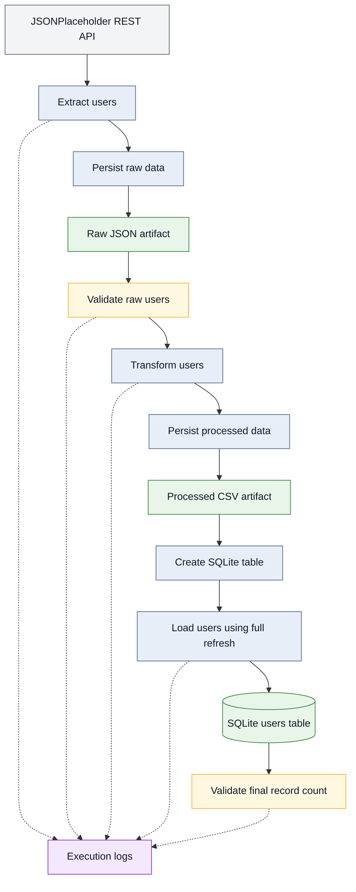
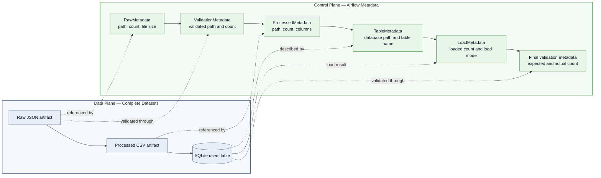

# Python Data Pipeline with Airflow Orchestration and Automated Testing


## Objective

This project implements a Python data pipeline that can run independently through `main.py` or be orchestrated with Apache Airflow.
The pipeline extracts data from a public REST API, persists raw records as JSON, validates and transforms the data, saves the processed dataset as CSV, loads it into SQLite, and validates the final result.
The project also demonstrates artifact-based communication between Airflow tasks, metadata-only XComs, automated testing, failure handling, idempotent loading, logging, containerization, and reproducible environment management.


## Technology Stack

### Data Pipeline

- **Python 3.13** — core pipeline development.
- **Pandas** — data transformation and tabular processing.
- **Requests** — data extraction from the REST API.
- **SQLite** — local storage for the processed dataset.

### Testing

- **Pytest** — automated unit and failure-scenario testing.

### Configuration and Observability

- **Python Dotenv** — environment-variable management.
- **Logging** — pipeline execution logs and error tracking.

### Environment Management

- **Conda** — isolated and reproducible Python environment management.

### Containerization

- **Docker** — containerized execution environment.
- **Docker Compose** — management of the Airflow services.

### Orchestration

- **Apache Airflow 3.3.0** — pipeline orchestration and task dependency management.
- **LocalExecutor** — local parallel task execution.
- **PostgreSQL** — Airflow metadata database.

### Version Control

- **Git** — source-code version control.
- **GitHub** — remote repository and project documentation.


## Pipeline Flow

The pipeline follows an artifact-based architecture. Complete datasets are persisted as JSON, CSV, and SQLite artifacts, while each processing stage validates or transforms the data before passing a reference to the next stage.




## Architecture Decisions

### Artifact-Based Data Flow

Complete datasets are persisted outside Airflow's metadata database:

- Raw records are stored as JSON.
- Transformed records are stored as CSV.
- Final records are stored in SQLite.

This prevents XCom from being used as dataset storage.

### Metadata-Only XComs

Airflow tasks exchange only small metadata contracts, including:

- Artifact paths.
- Record counts.
- File sizes.
- Table names.
- Load mode.
- Validation results.

Complete user lists and pandas DataFrames are not transported through XCom.

### Separation of Business Logic and Orchestration

Extraction, validation, transformation, persistence, and database logic remain inside the modules under `src/`.

Airflow is responsible only for:

- Task orchestration.
- Dependency management.
- Execution state.
- Scheduling and operational control.

This allows the same pipeline logic to run independently through `main.py`.

### Standalone and Orchestrated Execution

The pipeline supports two execution modes:

- Standalone Python execution using `main.py`.
- Airflow orchestration using the TaskFlow API.

This separation makes it possible to validate the pipeline independently of Airflow.

### Idempotent Database Loading

The SQLite load uses a full-refresh strategy.

Repeated executions replace the target dataset instead of appending duplicate records:

```text
First execution  → 10 records
Second execution → 10 records
```

### Explicit Validation Boundaries

The pipeline validates data at important boundaries:

- After API extraction.
- After raw artifact persistence.
- After processed artifact persistence.
- After the SQLite load.

Invalid, empty, corrupted, or inconsistent data causes the pipeline to fail with a contextual error message.


## Execution Modes

The same pipeline logic can be executed in two ways:

- **Standalone execution:** `main.py` runs the complete pipeline directly with Python.
- **Orchestrated execution:** Apache Airflow coordinates the pipeline through a six-task DAG.

In the Airflow implementation, extraction and raw persistence are grouped into one task. Transformation and processed-data persistence are also grouped into one task.

```text
extract_and_save_raw_task
→ validate_raw_users_task
→ transform_and_save_processed_task
→ create_users_table_task
→ load_users_to_database_task
→ validate_database_load_task
```

The business, transformation, validation, and loading logic remains inside the modules under `src`. Airflow is responsible for orchestration, task dependencies, execution state, and operational control.


## Data Plane and Control Plane Architecture

The pipeline separates the complete datasets from the metadata used to coordinate the workflow.

### Data Plane

The data plane contains the actual pipeline data:

- Raw user records stored in JSON.
- Transformed user records stored in CSV.
- Final user records stored in SQLite.

These artifacts persist the complete datasets outside Airflow's metadata database.

### Control Plane

The control plane contains the information required to coordinate and validate the workflow:

- Artifact paths.
- Record counts.
- File sizes.
- Table names.
- Load mode.
- Validation results.
- Task execution status.

Airflow XComs transport only these small metadata contracts. Complete user lists and pandas DataFrames are not transported between tasks.



This separation prevents Airflow's metadata database from being used as dataset storage and reduces coupling between task execution processes.

Each downstream task receives a serializable metadata reference through XCom and reads the corresponding persisted artifact only when the complete dataset is required.


## Project Structure

The structure below focuses on source code, configuration, tests, orchestration, and documentation. Local or generated files—such as `.env`, `.vscode/`, `.pytest_cache/`, `__pycache__/`, execution logs, JSON and CSV artifacts, SQLite databases, and backup files—are omitted.

```text
mini_pipeline_python/
│
├── airflow/
│   ├── config/
│   │   └── .gitkeep
│   │
│   ├── dags/
│   │   ├── minimal_airflow_validation.py
│   │   └── users_api_to_sqlite_pipeline.py
│   │
│   ├── plugins/
│   │   └── .gitkeep
│   │
│   ├── .env.example
│   └── docker-compose.yaml
│
├── data/
│   ├── database/
│   ├── processed/
│   └── raw/
│
├── logs/
│
├── src/
│   ├── __init__.py
│   ├── config.py
│   ├── contracts.py
│   ├── database.py
│   ├── extract.py
│   ├── load.py
│   ├── logger_config.py
│   ├── transform.py
│   └── validate.py
│
├── tests/
│   ├── test_database_load.py
│   ├── test_pipeline_functions.py
│   ├── test_processed_artifact.py
│   └── test_raw_validation.py
│
├── .dockerignore
├── .env.example
├── .gitignore
├── Dockerfile
├── environment.yml
├── main.py
├── pytest.ini
├── README.md
└── requirements.txt
```

### Main Components

- `main.py` executes the complete pipeline independently of Airflow.
- `src/` contains extraction, validation, transformation, persistence, database, logging, configuration, and metadata-contract logic.
- `tests/` contains automated tests for pipeline functions, artifacts, database loading, validation rules, and failure scenarios.
- `airflow/dags/` contains the infrastructure-validation DAG and the six-task production-style pipeline DAG.
- `airflow/docker-compose.yaml` defines the local Airflow environment and its supporting services.
- `data/` stores raw JSON files, processed CSV files, and the SQLite database generated during execution.
- `logs/` stores standalone pipeline execution logs.
- `environment.yml` defines the reproducible Conda environment.
- `requirements.txt` declares Python dependencies used by containerized execution.


## Local Environment Setup

The project uses a dedicated Conda environment named `mini_pipeline_python` to isolate its Python version and dependencies.

### Create the Environment

From the project root, run:

```powershell
conda env create -f environment.yml
```

### Activate the Environment

```powershell
conda activate mini_pipeline_python
```

### Verify the Active Interpreter

```powershell
python -c "import sys; print(sys.executable)"
```

The returned path should contain:

```text
\anaconda3\envs\mini_pipeline_python\python.exe
```

### Verify the Main Dependencies

```powershell
python -c "import pandas, requests, dotenv, pytest; print('Dependencies: OK')"
```

The environment is ready when the project interpreter is active and all required dependencies are successfully imported.


## API Configuration

Create a `.env` file in the project root based on `.env.example`.

On Windows PowerShell:

```powershell
Copy-Item .env.example .env
```

On Linux, macOS, or Git Bash:

```bash
cp .env.example .env
```

Example content:

```env
API_URL=https://jsonplaceholder.typicode.com/users
API_TIMEOUT_SECONDS=10
```

The `.env` file contains local configuration values and must not be committed to version control.


## Run the Standalone Pipeline

The pipeline can be executed independently of Airflow through `main.py`.

First, activate the project environment:

```powershell
conda activate mini_pipeline_python
```

Then run the pipeline from the project root:

```powershell
python main.py
```

A successful execution performs the following steps:

1. Extracts user data from the REST API.
2. Saves the raw dataset as a JSON artifact.
3. Validates the extracted records.
4. Transforms the data into the target structure.
5. Saves the processed dataset as a CSV artifact.
6. Creates the SQLite `users` table when necessary.
7. Loads the transformed records into SQLite.
8. Validates the final database record count.
9. Writes execution details to a log file.

The expected outputs are:

- A raw JSON file in `data/raw/`.
- A processed CSV file in `data/processed/`.
- A SQLite database in `data/database/`.
- An execution log in `logs/`.
- Ten consistent user records across the processed CSV and SQLite table.

Running the standalone pipeline validates the complete Python workflow independently of Airflow orchestration.


## Run the Tests

Activate the project environment:

```powershell
conda activate mini_pipeline_python
```

Run the complete test suite from the project root:

```powershell
python -m pytest tests -q
```

The automated tests cover:

- Successful validation and transformation.
- Invalid input types.
- Empty datasets and artifacts.
- Missing required fields.
- Null and duplicated identifiers.
- Corrupted JSON and CSV files.
- Invalid record counts.
- SQLite loading failures.
- Full-refresh and idempotency behavior.

A successful result should report that all tests passed.


## Run with Docker

Docker provides an isolated execution environment for the standalone Python pipeline.

### Build the Image

From the project root:

```powershell
docker build -t mini-pipeline-python .
```

### Run Without Persisting Artifacts

```powershell
docker run --rm --env-file .env mini-pipeline-python
```

The container and its generated files are removed after execution.

### Run with Persistent Artifacts

On Windows PowerShell:

```powershell
docker run --rm --env-file .env `
  --mount type=bind,source="${PWD}\data",target=/app/data `
  --mount type=bind,source="${PWD}\logs",target=/app/logs `
  mini-pipeline-python
```

The bind mounts preserve generated data and logs on the host machine.


## Generated Artifacts

Each successful pipeline execution may generate:

| Artifact | Location | Purpose |
|---|---|---|
| Raw JSON | `data/raw/` | Preserves the API response before transformation |
| Processed CSV | `data/processed/` | Stores the transformed tabular dataset |
| SQLite database | `data/database/` | Stores the final `users` table |
| Execution log | `logs/` | Records pipeline events and failures |

These runtime artifacts are ignored by Git and are not committed to the repository.


## Final SQLite Table

The `users` table contains the following columns:

```text
user_id
name
email
city
zipcode
latitude
longitude
company_name
processed_at
```

The `processed_at` field is stored in ISO 8601 format to preserve an unambiguous and sortable timestamp representation.


## Testing and Regression Strategy

The project uses different validation levels because one successful execution does not prove that every pipeline layer works correctly.

```text
Unit tests
→ validate isolated Python functions

Standalone execution
→ validates integration between the Python modules

Airflow DAG execution
→ validates orchestration and task dependencies

Repeated execution
→ validates idempotency

Artifact and record-count checks
→ validate consistency across pipeline stages
```

The expected record-count relationship is:

```text
Raw records
=
Processed records
=
SQLite records
```

For the current JSONPlaceholder dataset, the expected result is ten user records.

During regression testing, standalone execution detected an integration mismatch: `save_processed_data()` expected a list of dictionaries, while `main.py` passed a pandas DataFrame.

The handoff was corrected so that the persistence function receives the transformed records before the DataFrame is created for the SQLite load.


## Airflow Orchestration

The project includes a local Apache Airflow environment based on:

- Apache Airflow 3.3.0.
- Docker Compose.
- LocalExecutor.
- PostgreSQL as the Airflow metadata database.
- TaskFlow API.

The main DAG is:

```text
users_api_to_sqlite_pipeline
```

It contains six tasks:

```text
extract_and_save_raw_task
→ validate_raw_users_task
→ transform_and_save_processed_task
→ create_users_table_task
→ load_users_to_database_task
→ validate_database_load_task
```

The reusable pipeline logic remains in `src/`. Airflow coordinates task execution, dependencies, state, and operational behavior.


## Run with Airflow

### Enter the Airflow Directory

```powershell
cd airflow
```

### Create the Local Configuration File

```powershell
Copy-Item .env.example .env
```

Review the local values in `.env`, especially the administrator username and password.

### Initialize the Environment

```powershell
docker compose up airflow-init
```

The initialization service should finish successfully with exit code `0`.

### Start the Services

```powershell
docker compose up -d
```

Verify their status:

```powershell
docker compose ps -a
```

Expected services include:

```text
postgres
airflow-api-server
airflow-scheduler
airflow-dag-processor
airflow-triggerer
```

### Open the Airflow Interface

```text
http://localhost:8080
```

The administrator credentials are defined in `airflow/.env`.

### Validate the Airflow Environment

Confirm the installed version:

```powershell
docker compose exec airflow-scheduler airflow version
```

Confirm the executor:

```powershell
docker compose exec airflow-scheduler `
  airflow config get-value core executor
```

List the recognized DAGs:

```powershell
docker compose exec airflow-scheduler airflow dags list
```

Check for DAG import errors:

```powershell
docker compose exec airflow-scheduler `
  airflow dags list-import-errors --local
```

Validate the metadata database:

```powershell
docker compose exec airflow-scheduler airflow db check
```

List the tasks in the main DAG:

```powershell
docker compose exec airflow-scheduler `
  airflow tasks list users_api_to_sqlite_pipeline
```

### Execute the DAG

In the Airflow interface:

1. Open `users_api_to_sqlite_pipeline`.
2. Enable the DAG when necessary.
3. Select **Trigger DAG**.
4. Wait for all six tasks to complete successfully.
5. Inspect task logs and XCom return values.

The XCom values must contain metadata and artifact references rather than complete datasets.


## Stop and Restart Airflow

Stop the services without removing their containers:

```powershell
docker compose stop
```

Restart the existing containers:

```powershell
docker compose restart
```

Remove the containers while preserving the PostgreSQL volume:

```powershell
docker compose down
```

Recreate them:

```powershell
docker compose up -d
```

Do not use the following command when Airflow metadata must be preserved:

```powershell
docker compose down --volumes
```

The `--volumes` option removes the persistent PostgreSQL volume.


## Reliability and Idempotency

The SQLite load uses a full-refresh strategy.

Before inserting the current dataset, the pipeline removes the existing target records. Repeated executions therefore replace the dataset instead of appending duplicates.

Expected behavior:

```text
First execution  → 10 records
Second execution → 10 records
```

An incorrect append-based implementation would produce twenty records after the second execution.

The pipeline also applies explicit validation at important boundaries and fails with contextual error messages when data is missing, empty, corrupted, or inconsistent.


## Current Project Status

Completed:

- Modular standalone Python pipeline.
- REST API extraction.
- Raw JSON persistence.
- Data validation and transformation.
- Processed CSV persistence.
- SQLite loading and final validation.
- Logging and contextual error handling.
- Dedicated Conda environment.
- Dockerized standalone execution.
- Automated test suite.
- Negative and failure-scenario tests.
- Idempotent full-refresh loading.
- Local Airflow environment with Docker Compose.
- PostgreSQL metadata database.
- LocalExecutor configuration.
- Minimal Airflow validation DAG.
- Six-task pipeline DAG.
- Artifact-based communication between tasks.
- Metadata-only XCom contracts.
- Standalone and orchestrated regression validation.


## Next Steps

Planned future improvements include:

1. Configure retries and retry delays.
2. Add task and execution timeouts.
3. Introduce scheduling and external parameters.
4. Add operational data-quality gates.
5. Implement alerts and failure notifications.
6. Manage connections and secrets through Airflow.
7. Practice backfills and historical reprocessing.
8. Improve monitoring and observability.
9. Evaluate PostgreSQL as a future pipeline destination.
10. Integrate dbt in a later transformation layer.
11. Evolve the pipeline toward Spark, PySpark, and Databricks.


## License

This project was developed for educational and portfolio purposes.