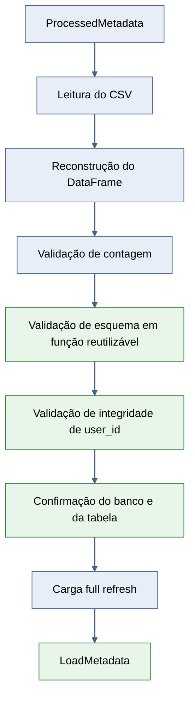
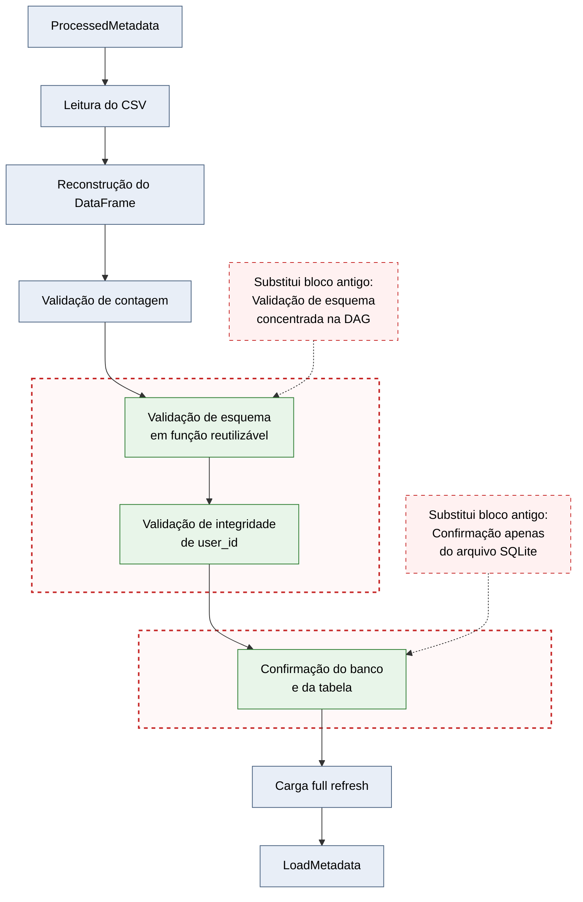

# Fase 5 — Passo 7: refatorar e fortalecer a carga no SQLite

## Objetivo do passo

Fortalecer a carga do CSV processado no SQLite por meio de contratos
tipados, validação de esquema, integridade da chave, confirmação do
destino e execução idempotente em full refresh.

## Fluxo antes

## Fluxo depois

## Conceitos de Engenharia de Dados aplicados

### Contrato de dados

TableMetadata e LoadMetadata formalizam as interfaces entre criação da
tabela, carga e validação final.

### Validação de esquema

O DataFrame precisa conter todas as colunas esperadas antes da carga.

### Integridade da chave

user_id não pode conter valores nulos ou duplicados.

### Validação do destino

A carga verifica se o banco e a tabela users existem antes da escrita.

### Idempotência

A estratégia full refresh remove o estado anterior antes da inserção.
Dessa forma, reexecutar a mesma carga não duplica os registros.

## Decisões arquiteturais e justificativas

O CSV permanece como artefato físico da camada processada.

O XCom transporta somente ProcessedMetadata, TableMetadata e
LoadMetadata.

O DataFrame é reconstruído e utilizado apenas dentro da task de carga.

A validação do DataFrame foi mantida em src/validate.py para separar
regra de qualidade e código de orquestração.

A estratégia full refresh foi preservada por ser simples, previsível e
idempotente para o volume atual do projeto.

## Arquivos alterados

- src/contracts.py
- src/database.py
- src/validate.py
- airflow/dags/users_api_to_sqlite_pipeline.py
- tests/test_database_load.py
- docs/phase-5-xcoms-e-artefatos/step-07-refatorar-carga-sqlite.md

## Testes e critérios de aprovação

- DataFrame válido aprovado.
- Divergência de contagem rejeitada.
- Coluna obrigatória ausente rejeitada.
- user_id duplicado rejeitado.
- Existência da tabela users confirmada.
- Duas cargas consecutivas mantiveram a mesma quantidade de registros.
- DAG importada sem erros.
- Duas DAG Runs concluídas com sucesso.
- XCom da carga contendo apenas LoadMetadata.

## Resultado final

A carga passa a operar com contrato explícito, esquema validado,
integridade da chave, destino confirmado e comportamento idempotente.

Os registros completos permanecem no CSV, no DataFrame local da task e
no SQLite, sem circular pelo XCom.

## Próximo passo

Passo 8 — validar artefatos inválidos e cenários de falha controlada.
