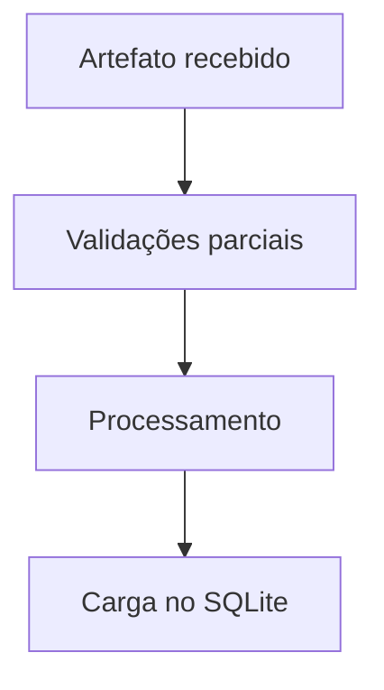
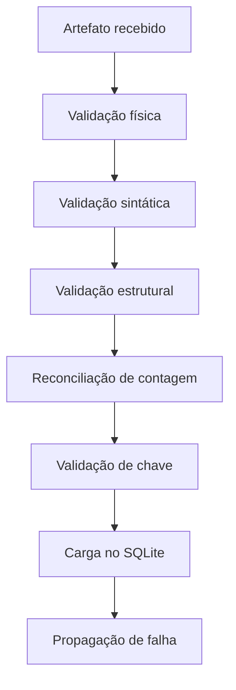

# Fase 5 — Passo 8: validar artefatos e falhas controladas

## Objetivo do passo

Comprovar que o pipeline rejeita arquivos ausentes, vazios,
corrompidos ou inconsistentes, apresentando mensagens diagnosticáveis
e interrompendo o processamento antes que dados inválidos avancem.

## Fluxo antes

## Fluxo depois

## Conceitos de Engenharia de Dados aplicados

### Negative testing

Entradas inválidas são criadas deliberadamente para comprovar o
comportamento do pipeline fora do cenário ideal.

### Fail-fast

O processamento é interrompido assim que uma inconsistência é
identificada.

### Observabilidade de falhas

Erros técnicos são convertidos em mensagens associadas ao arquivo ou
à operação que falhou.

### Failure injection

Uma falha de escrita no SQLite é simulada por meio de monkeypatch,
sem comprometer o ambiente real.

### Teste de regressão

Todos os testes anteriores são executados novamente para garantir que
os novos tratamentos de erro não afetaram os cenários válidos.

## Decisões arquiteturais e justificativas

As validações permanecem nas funções reutilizáveis de src, enquanto o
Airflow continua responsável pela orquestração e propagação dos
estados das tasks.

Os artefatos inválidos são testados em diretórios temporários
fornecidos pelo pytest.

Não são corrompidos manualmente os arquivos reais do projeto.

A falha de escrita é simulada em teste para manter o ambiente isolado
e reproduzível.

## Arquivos alterados

- src/load.py
- tests/test_raw_validation.py
- tests/test_processed_artifact.py
- tests/test_database_load.py
- docs/phase-5-xcoms-e-artefatos/step-08-validar-artefatos-e-falhas.md

## Testes e critérios de aprovação

- Extensão raw incorreta rejeitada.
- JSON sintaticamente inválido rejeitado.
- Objeto JSON incompatível rejeitado.
- Lista raw vazia rejeitada.
- CSV inexistente rejeitado.
- Caminho que aponta para diretório rejeitado.
- CSV com zero bytes rejeitado.
- CSV sem registros rejeitado.
- Contagem divergente rejeitada.
- Coluna obrigatória ausente rejeitada.
- user_id nulo ou duplicado rejeitado.
- Falha simulada de escrita propagada.
- Suíte completa aprovada.
- DAG Run válida concluída com sucesso.

## Resultado final

O pipeline passa a possuir cobertura explícita dos principais cenários
de falha dos artefatos raw, processados e da carga no SQLite.

As falhas são interrompidas no ponto de origem e não permitem que
tasks downstream processem dados inválidos.

## Próximo passo

Passo 9 — validar os XComs finais e comprovar que contêm somente
referências e metadados pequenos.
