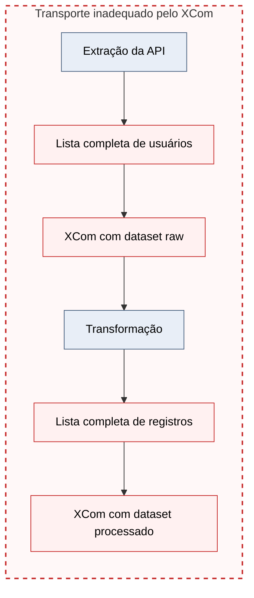
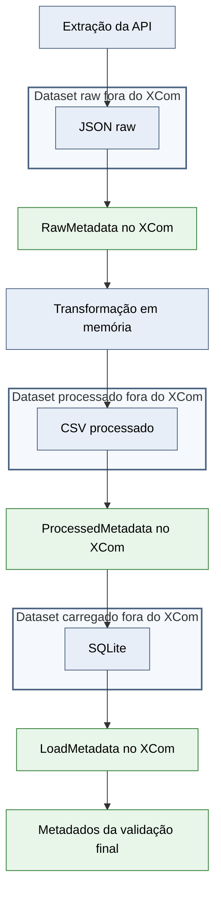

# Fase 5 — Passo 9: validar os XComs finais

## Objetivo

Comprovar que os XComs da DAG transportam somente referências e
metadados pequenos, mantendo os datasets completos nos artefatos JSON,
CSV e SQLite.

## Fluxo anterior

## Fluxo atual

## Conceitos de Engenharia de Dados

### Plano de controle e plano de dados

Os XComs pertencem ao plano de controle e transportam caminhos,
contagens, nomes e status.

JSON, CSV e SQLite pertencem ao plano de dados e armazenam os datasets
completos.

### Pointer/reference pattern

As tasks downstream recebem referências para os artefatos e
reconstroem os dados somente quando necessário.

### Fronteira de serialização

Os objetos que atravessam tasks precisam ser serializáveis, pequenos e
independentes do processo que os criou.

### Observabilidade dos contratos

Os valores reais dos XComs foram inspecionados na interface do Airflow
após uma DAG Run bem-sucedida.

## XComs validados

- RawMetadata.
- ValidationMetadata.
- ProcessedMetadata.
- TableMetadata.
- LoadMetadata.
- Metadados da validação final.

## Critérios de aprovação

- Nenhum XCom contém lista completa de usuários.
- Nenhum XCom contém DataFrame.
- Nenhum XCom contém registros transformados.
- Nenhum XCom contém conteúdo integral de JSON ou CSV.
- Os XComs contêm apenas referências e metadados.
- Cada retorno utiliza a chave return_value.
- A DAG conclui as seis tasks com sucesso.
- Os artefatos permanecem persistidos fora do banco de metadados do
  Airflow.

## Resultado final

A comunicação entre tasks utiliza somente metadados pequenos, enquanto
os datasets completos permanecem nas camadas raw, processed e
database.

A arquitetura reduz o acoplamento entre workers e evita utilizar o
banco de metadados do Airflow como armazenamento de datasets.

## Próximo passo

Passo 10 — executar a regressão final da Fase 5 e consolidar a
documentação da arquitetura.
